# 🎬 Movie Ticket Booking System - Low-Level Design (LLD)

A robust, highly scalable, and thread-safe Movie Ticket Booking System built in Java. This architecture strictly adheres
to **SOLID principles** and utilizes industry-standard **Design Patterns** to handle complex requirements like dynamic
pricing, concurrent seat locking, and asynchronous event notifications.

## 🏗️ Architecture Overview

The system is designed with a strict separation of concerns, divided into four primary layers:

1. **Presentation Layer (Controllers & DTOs):** Handles incoming requests and formats responses.
2. **Orchestration Layer (Facade):** Manages the complex workflow of booking a ticket (Locking -> Pricing ->
   Reserving -> Paying).
3. **Business/Domain Layer (Services & Models):** Contains core business logic, dynamic pricing strategies, concurrency
   locks, and rich domain models.
4. **Data Access Layer (Repositories):** Abstracts the database interactions, allowing easy swapping between In-Memory
   stores and actual SQL/NoSQL databases.

### 🎯 Key Design Patterns Used

* **Facade Pattern (`BookingFacade`):** Hides the complex interactions between locks, pricing, and payments behind a
  simple interface for the Controller.
* **Strategy Pattern (`PricingStrategy` & `PricingEngine`):** Allows admins to inject new dynamic pricing rules (e.g.,
  weekend surge, recliner premium) without modifying existing calculation logic (Open/Closed Principle).
* **Observer Pattern (`BookingEventListener`):** Decouples post-booking side effects (like sending emails or SMS) from
  the core transactional booking flow.
* **Repository Pattern:** Isolates domain objects from database specifics (Dependency Inversion Principle).

---

## 🗺️ Class Diagram

The following Mermaid diagram maps out the entire system, including all Enums, Domain Models, Repositories, Services,
Controllers, and DTOs.

* **Key:** * `*--` : Composition (Strong lifecycle dependency)
    * `o--` : Aggregation (Weak lifecycle dependency)
    * `-->` : Directed Association
    * `<|..`: Realization / Implementation

```mermaid
classDiagram

    %% =======================
    %% ENUMS
    %% =======================
    class BookingStatus { <<enumeration>> PENDING, CONFIRMED, CANCELLED, EXPIRED }
    class PaymentStatus { <<enumeration>> PENDING, SUCCESS, FAILED, REFUNDED }
    class SeatType { <<enumeration>> REGULAR, PREMIUM, RECLINER, VIP }
    class UserRole { <<enumeration>> ADMIN, CUSTOMER }
    class DayType { <<enumeration>> WEEKDAY, WEEKEND }
    class ShowType { <<enumeration>> MORNING, AFTERNOON, EVENING, NIGHT }
    class SeatAvailabilityStatus { <<enumeration>> AVAILABLE, LOCKED, BOOKED }

    %% =======================
    %% DOMAIN MODELS
    %% =======================
    class Money {
        -BigDecimal amount
        -String currency
        +add(Money) Money
    }

    class Seat {
        -String id
        -String row
        -int number
        -SeatType seatType
        +getSeatLabel() String
    }

    class ShowSeat {
        -String id
        -Seat seat
        -String showId
        -SeatAvailabilityStatus status
        +lock()
        +book()
        +release()
    }

    class Booking {
        -String id
        -String customerId
        -String showId
        -List~ShowSeat~ seats
        -Money totalAmount
        -BookingStatus status
        +confirm()
        +cancel()
        +expire()
    }

    class Payment {
        -String id
        -String bookingId
        -Money amount
        -PaymentStatus status
        +markAsSuccess()
        +markAsFailed()
        +markAsRefunded()
    }

    class PricingRule {
        -String id
        -String name
        -Money surcharge
        -SeatType seatTypeFilter
        -ShowType showTypeFilter
        -DayType dayTypeFilter
        -boolean isActive
        +deactivate()
    }

    class SeatLock {
        -String id
        -String showSeatId
        -String userId
        -Instant expiresAt
        +isActive() boolean
        +isExpired() boolean
    }

    class Movie {
        -String id
        -String title
        -List~String~ languages
        -List~String~ genres
        -int durationMinutes
        -LocalDate releaseDate
    }

    class Theatre {
        -String id
        -String name
        -String city
        -List~Screen~ screens
        +addScreen(Screen)
    }

    class Screen {
        -String id
        -String theatreId
        -String name
    }

    class Show {
        -String id
        -String movieId
        -String screenId
        -LocalDateTime startTime
    }

    %% Relationships Models
    ShowSeat o-- Seat : Aggregation
    Booking o-- ShowSeat : Aggregation
    Booking *-- Money : Composition
    Payment *-- Money : Composition
    PricingRule *-- Money : Composition
    Theatre *-- Screen : Composition
    ShowSeat --> SeatAvailabilityStatus
    Booking --> BookingStatus
    Payment --> PaymentStatus

    %% =======================
    %% REPOSITORIES (Interfaces & Impls)
    %% =======================
    class BookingRepository { <<interface>> +save(Booking), +findById(String), +findByStatus(BookingStatus) }
    class PaymentRepository { <<interface>> +save(Payment), +findByBookingId(String) }
    class PricingRuleRepository { <<interface>> +save(PricingRule), +findActiveRules() }
    class ShowSeatRepository { <<interface>> +findAllById(List), +findByShowId(String), +saveAll(List) }
    class ShowRepository { <<interface>> +findById(String), +findByMovieAndCity(String, String) }
    class MovieRepository { <<interface>> +findById(String), +findMoviesPlayingInCity(String) }
    class TheatreRepository { <<interface>> +findById(String), +findByCity(String) }

    class InMemoryBookingRepository
    class InMemoryPaymentRepository
    class InMemoryPricingRuleRepository
    class InMemoryShowSeatRepository
    class InMemoryShowRepository
    class InMemoryMovieRepository
    class InMemoryTheatreRepository

    BookingRepository <|.. InMemoryBookingRepository
    PaymentRepository <|.. InMemoryPaymentRepository
    PricingRuleRepository <|.. InMemoryPricingRuleRepository
    ShowSeatRepository <|.. InMemoryShowSeatRepository
    ShowRepository <|.. InMemoryShowRepository
    MovieRepository <|.. InMemoryMovieRepository
    TheatreRepository <|.. InMemoryTheatreRepository

    %% =======================
    %% SERVICES & FACADES
    %% =======================
    class PricingStrategy { <<interface>> +calculateExtraCharge(ShowSeat, Show) Money }
    class DataDrivenPricingStrategy { +calculateExtraCharge(ShowSeat, Show) Money }
    PricingStrategy <|.. DataDrivenPricingStrategy
    DataDrivenPricingStrategy --> PricingRule : Uses

    class PricingEngine {
        +calculateFinalPrice(ShowSeat, Show, Money) Money
    }
    PricingEngine --> PricingRuleRepository
    PricingEngine --> PricingStrategy : Evaluates

    class SeatLockProvider {
        -ConcurrentHashMap~String, SeatLock~ locks
        +lockSeats(List, String, List) boolean
        +unlockSeats(List)
        +isSeatLocked(String) boolean
    }
    SeatLockProvider *-- SeatLock : Composition

    class BookingEventListener { <<interface>> +onBookingConfirmed(Booking), +onBookingCancelled(Booking), +onBookingExpired(Booking) }
    
    class BookingExpiryScheduler {
        -ScheduledExecutorService scheduler
        +start()
        +stop()
        -sweepExpiredBookings()
    }
    BookingExpiryScheduler --> BookingRepository
    BookingExpiryScheduler --> SeatLockProvider
    BookingExpiryScheduler --> BookingEventListener

    class PaymentService {
        +process(Payment, String, String)
        +refund(Payment)
    }
    PaymentService --> PaymentRepository

    class SearchService {
        +getTheatresByCity(String)
        +getMoviesByCity(String)
        +getShowsForMovieInCity(String, String)
        +getSeatAvailabilityForShow(String)
    }
    SearchService --> TheatreRepository
    SearchService --> MovieRepository
    SearchService --> ShowRepository
    SearchService --> ShowSeatRepository

    class BookingFacade {
        +initiateBooking(BookingRequest) BookingResponse
        +confirmBooking(String, PaymentRequest) String
        +cancelBooking(String, String) String
    }
    BookingFacade --> BookingRepository
    BookingFacade --> ShowSeatRepository
    BookingFacade --> ShowRepository
    BookingFacade --> SeatLockProvider
    BookingFacade --> PricingEngine
    BookingFacade --> PaymentService
    BookingFacade --> PaymentRepository
    BookingFacade o-- BookingEventListener

    %% =======================
    %% DTOs
    %% =======================
    class BookingRequest
    class BookingResponse
    class PaymentRequest
    class AddPricingRuleRequest
    class MovieResponse
    class ShowResponse
    class SeatAvailabilityResponse

    %% =======================
    %% CONTROLLERS
    %% =======================
    class BookingController {
        +createBooking(BookingRequest) BookingResponse
        +confirmBooking(String, PaymentRequest) String
        +cancelBooking(String, String) String
    }
    BookingController --> BookingFacade

    class SearchController {
        +getTheatresByCity(String) List
        +getMoviesByCity(String) List
        +getShows(String, String) List
        +getSeatAvailability(String) List
    }
    SearchController --> SearchService

    class AdminController {
        +addPricingRule(AddPricingRuleRequest) String
    }
    AdminController --> PricingRuleRepository

```

---

## 🛡️ Thread Safety & Concurrency

A core feature of this architecture is its ability to handle high-traffic movie releases without race conditions or
double-booking.

* **Atomic Locking:** The `SeatLockProvider` utilizes a `ConcurrentHashMap` and `synchronized` locking blocks to ensure
  that if 1,000 users click "Book" on the exact same seat simultaneously, exactly 1 request succeeds while the other 999
  are rejected instantly.
* **Orphaned Lock Reclamation:** The `BookingExpiryScheduler` runs a background Daemon thread using Java's
  `ScheduledExecutorService`. It periodically sweeps the database for `PENDING` bookings whose 10-minute TTL (
  Time-To-Live) locks have expired, automatically releasing the seats back into the pool.

## 🚀 How to Run the Demo

The system includes a `DemoDataSeeder` and a `Main` class that acts as the client simulating a real-world scenario.

1. Ensure you have Java 17+ installed.
2. Compile and run the `Main.java` file.
3. The console will output the flow of:
    - The Admin setting up a Recliner Surcharge rule.
    - User 1 successfully locking 2 seats.
    - User 2 attempting to snipe those seats (and being blocked by the Concurrency protocol).
    - User 1 completing the payment.
    - User 1 subsequently canceling the booking to demonstrate seat release.